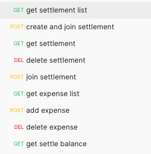

# 12. Tricount 클론 코딩

- (과제 설명)
    - **[Tricount](https://www.tricount.com/en/)**라는 정산 어플리케이션(Play Store, App Store에 있음)의 서버 파트를 클론코딩해보는 실습과제 입니다.
- (기능 요구사항)
    - **[Tricount](https://www.tricount.com/en/)** 참고 바랍니다.
    - 회원가입
        - 유저의 유니크 키(DB primary key), 유저 아이디/비밀번호, 이름(닉네임) 으로 구성합니다.
    - 정산(settlement)
        - 한 유저당 정산을 여러개 만들 수 있습니다.
        - 유저는 여러 정산에 참가할 수 있습니다.
        - 특정 정산에 참가(join)을 한 유저들만 정산 내역(=지출)들을 열람할 수 있습니다.
            - ex) 강릉 여행 정산 - 유저 1, 유저2 참가
            - 망년회 정산 - 유저 1, 유저 3 참가
            - ⇒ 유저2는 망년회 정산을 보지 못하고, 유저3은 강릉 여행 정산 열람이 불가능합니다.
            - 유저1의 정산 목록에는 강릉 여행 정산과 망년회 정산 두개가 노출됩니다.
            - 유저2의 정산 목록에는 강릉 여행 정산이 노출됩니다.
            - 유저3의 정산 목록에는 망년회 정산이 노출됩니다.
- 정산 결과 (balance)
    - 하나의 정산은 하나의 정산 결과를 가지고 있습니다. (1:1 대응)
    - 정산 결과에서는 정산에 참여(join)한 유저끼리 송금을 얼만큼 해줘야 하는지를 보여줘야 합니다
    - ex) 위의 강릉 여행 정산의 정산 결과 예시
        - 유저 2 > 유저 1 : 230,000 원 송금
    - ex2) 두명 이상이 참여한 정산
        - 유저 1 : 150,000 원 지출
        - 유저 2 : 30,000 원 지출
        - 유저 3 : 80,000 원 지출
        - 유저 4 : 100,000 원 지출
    - ⇒ 총 정산 금액 360,000원
        - 360,000원 / 4명 = 90,000원
        - 유저 1은 6만원을 받아야함
        - 유저 2는 6만원을 지불해야함
        - 유저 3은 1만원을 지불해야함
        - 유저 4는 1만원을 받아야함
    - ⇒ 유저 2 > 유저1 : 60,000원 송금
    - ⇒ 유저 3 > 유저4 : 10,000원 송금
- 정산 결과(balance)에 대한 응답값은 한 유저가 다른 유저에게 얼만큼 전송하는지의 금액만 내려줍니다. 모두 같은 금액을 지출하여 정산할 내역이 없을 경우 빈 결과를 내려줍니다.

```json
[
    {
        "senderUserNo": 2,
        "senderUserName": "유저2",
        "sendAmount": 60000,
        "receiverUserNo": 1,
        "receiverUserName": "유저1"
    },
    {
        "senderUserNo": 3,
        "senderUserName": "유저3",
        "sendAmount": 10000,
        "receiverUserNo": 4,
        "receiverUserName": "유저4"
    }
]
```
---

- 기능 구현사항에 명시된 기능만 구현하면 되며, 이외의 조건은 과제 진행자가 자율적으로 설계하여 진행합니다.
- (구현 요구사항)
    - 스프링 부트 사용
        - AutoConfiguration 사용
        - 어플리케이션이 executable jar로 패키징되어 java -jar로 실행이 가능해야합니다.
    - 회원가입 기능
        - **[스프링 MVC 2편](https://www.inflearn.com/course/%EC%8A%A4%ED%94%84%EB%A7%81-mvc-2#curriculum)** 커리큘럼 중 **[섹션 6. 로그인 처리1 - 쿠키, 세션], [섹션 7. 로그인 처리2 - 필터, 인터셉터]** 코드를 활용
    - 데이터 저장 기능
        - H2 데이터베이스 이용
        - JdbcTemplate 이용
    - API만 구현하면 되며, 웹 화면 구성 등의 프론트 기능을 구현할 필요 없습니다.
    - JSON 통신을 합니다.
    - 금액을 다룰때는 BigDecimal 클래스로 하며, 1원 단위에서 반올림을 합니다.
    - CRUD 중 Update에 대한 기능은 제외해도 됩니다. (Create, Read, Delete 만 구현)

---

- (필수 API 목록)
- **[참고 목록](https://prod-files-secure.s3.us-west-2.amazonaws.com/faf1d3be-e3fc-4d9f-92ce-5ba505b2962b/65935d6a-cf77-42e4-a3d6-a61f048f69c5/Tricount_Clone_Assignment.postman_collection.json)**
- 위 목록을 참고하시면 됩니다. postman이 있으시면 해당 프로그램으로 여시고, 없으신 경우 다운로드 하거나 VisualStudioCode 또는 메모장으로 열고 item 하위의 항목들을 참고하시면됩니다.



* (수행기간)
  * 12일
* (결과물)
    * 위 기능을 구현한 executable jar 파일
    * 링크로 제출 시 구글 드라이브에 업로드하여 링크 공유 (액세스 허용 설정 필수)